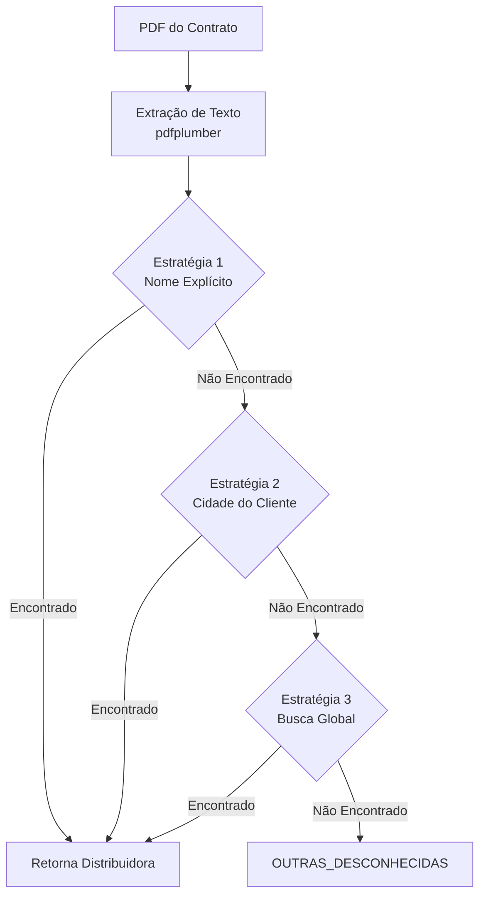

# Sistema de Identificação de Distribuidoras de Energia

## Documentação Técnica Completa

**Autor:** Assistente de IA  
**Data:** 2026-01-08  
**Versão:** 4.0  
**Script:** `super_organizer_v4.py`

---

## 1. Visão Geral

### 1.1. Objetivo do Sistema

O sistema de identificação de distribuidoras foi desenvolvido para **classificar automaticamente contratos de energia solar** da Raízen GD, organizando-os por distribuidora responsável pela área de concessão onde se encontra a unidade consumidora (UC).

### 1.2. Contexto do Problema

A Raízen GD possui **6.309 contratos de adesão** a consórcios de energia solar. Cada contrato está vinculado a uma **unidade consumidora** localizada em algum município brasileiro, que por sua vez é atendida por uma **distribuidora de energia** específica (ex: CPFL Paulista, CEMIG, ENEL SP, etc.).

### 1.3. Desafios Identificados

1. **Heterogeneidade de formatos**: Contratos originados de diferentes plataformas (Clicksign, Docusign, ZapSign)
2. **Variações na estrutura**: PDFs com layouts diferentes dependendo do modelo de contrato
3. **Dados incompletos**: Alguns contratos não mencionam explicitamente a distribuidora
4. **Múltiplos endereços**: Contratos podem conter endereços da sede da empresa E da UC
5. **Falsos positivos**: Palavras que parecem nomes de distribuidoras mas não são

---

## 2. Arquitetura do Sistema

### 2.1. Fontes de Dados

O sistema utiliza **duas bases de dados oficiais** fornecidas pela Raízen:

```
📁 Bases de Dados
├── AreaatuadistbaseBI.xlsx
│   └── Contém: Siglas e Razões Sociais de 97+ distribuidoras
│
└── PAINEL DE DESEMPENHO DAS DISTRIBUIDORAS POR MUNICÍPIO.xlsx
    └── Contém: Mapeamento de 5.267 municípios → Distribuidoras
```

#### 2.1.1. Base de Distribuidoras (`AreaatuadistbaseBI.xlsx`)

| Campo | Descrição | Exemplo |
|-------|-----------|---------|
| SIGLA | Código abreviado da distribuidora | `CEMIG-D` |
| Razão Social | Nome completo registrado | `CEMIG DISTRIBUIÇÃO S.A.` |
| UF | Estado de atuação | `MG` |

#### 2.1.2. Base de Municípios (`PAINEL DE DESEMPENHO...xlsx`)

| Campo | Descrição | Exemplo |
|-------|-----------|---------|
| Município | Nome da cidade | `Belo Horizonte` |
| Distribuidora | Distribuidora responsável | `Cemig-D` |

### 2.2. Pipeline de Processamento



---

## 3. Estratégias de Identificação

O sistema implementa uma **abordagem de 3 camadas** (fallback), onde cada estratégia é tentada sequencialmente até que uma identificação positiva seja obtida.

### 3.1. Estratégia 1: Nome Explícito Próximo à Palavra "DISTRIBUIDORA"

#### 3.1.1. Lógica

Esta é a estratégia **mais confiável** pois busca por menções explícitas da distribuidora no documento.

```python
# Pseudocódigo
para cada linha no texto:
    se "DISTRIBUIDORA" está na linha:
        contexto = linha_atual + próxima_linha
        para cada nome_distribuidora na lista:
            se nome está no contexto:
                retorna nome
```

#### 3.1.2. Padrões Capturados

| Padrão no PDF | Distribuidora Identificada |
|---------------|---------------------------|
| `Distribuidora: SP - ELEKTRO` | ELEKTRO |
| `DISTRIBUIDORA: MG - CEMIG` | CEMIG |
| `Distribuidora: TO - ENERGISA TO` | ENERGISA |

#### 3.1.3. Justificativa

Quando o contrato menciona explicitamente a distribuidora próximo à palavra "DISTRIBUIDORA:", esta é a informação **mais autoritativa** disponível, pois foi inserida no momento da geração do documento pela equipe comercial.

#### 3.1.4. Limitações

- Nem todos os contratos possuem este campo preenchido
- Alguns contratos têm layouts onde a informação não aparece nas primeiras páginas

---

### 3.2. Estratégia 2: Identificação por Cidade do Cliente

#### 3.2.1. Lógica

Quando não há menção explícita da distribuidora, o sistema extrai a **cidade do endereço do cliente** e cruza com a base de municípios.

```python
# Pseudocódigo
para cada linha no texto:
    se linha contém padrão "Cidade - UF" ou "Cidade/UF":
        se linha NÃO é endereço da Raízen:
            cidade = extrair_cidade(linha)
            se cidade está na base_municipios:
                retorna base_municipios[cidade]
```

#### 3.2.2. Padrões de Cidade/Estado Reconhecidos

O sistema reconhece múltiplos formatos de endereço brasileiro:

| Formato | Exemplo | Regex |
|---------|---------|-------|
| Cidade - UF | `São Paulo - SP` | `([A-Z][A-Z\s]{2,30})\s*[-]\s*([A-Z]{2})` |
| Cidade/UF | `Campinas/SP` | `([A-Z][A-Z\s]{2,30})\s*[/]\s*([A-Z]{2})` |
| Cidade, UF | `Curitiba, PR` | `([A-Z][A-Z\s]{2,30})\s*[,]\s*([A-Z]{2})` |
| Cidade - Estado | `Belo Horizonte-Minas Gerais` | `([A-Z][A-Z\s]{2,30})\s*[-]\s*(MINAS GERAIS\|...)` |

#### 3.2.3. Estados Reconhecidos por Extenso

```python
ESTADOS_BR = (
    "ACRE|ALAGOAS|AMAPA|AMAZONAS|BAHIA|CEARA|DISTRITO FEDERAL|"
    "ESPIRITO SANTO|GOIAS|MARANHAO|MATO GROSSO DO SUL|MATO GROSSO|"
    "MINAS GERAIS|PARA|PARAIBA|PARANA|PERNAMBUCO|PIAUI|RIO DE JANEIRO|"
    "RIO GRANDE DO NORTE|RIO GRANDE DO SUL|RONDONIA|RORAIMA|"
    "SANTA CATARINA|SAO PAULO|SERGIPE|TOCANTINS"
)
```

#### 3.2.4. Filtro de Endereços da Raízen

**Problema crítico identificado**: Todos os contratos contêm o endereço da sede da Raízen (Piracicaba/SP), o que causava falsos positivos.

**Solução implementada**: Lista de endereços específicos da Raízen a serem **ignorados**:

```python
RAIZEN_ADDRESSES = [
    "CEZIRA GIOVANONI MORETTI",   # Rua da sede
    "ROD SP-308",                  # Rodovia da sede
    "SP-308",                      # Variação
    "FAZENDA COSTA PINTO",         # Endereço alternativo
    "13411-900",                   # CEP da sede
    "28.986.143/0001-33",          # CNPJ Raízen GD
    "RAIZEN GD LTDA",              # Nome da empresa
]
```

> ⚠️ **Nota Importante**: A cidade "PIRACICABA" **NÃO** está nesta lista, pois clientes de Piracicaba são legítimos e devem ser classificados como CPFL Paulista.

#### 3.2.5. Justificativa

Esta estratégia é baseada no fato de que a **área de concessão** de cada distribuidora é determinada geograficamente. Cada município brasileiro é atendido por exatamente uma distribuidora (em área urbana padrão).

#### 3.2.6. Casos de Múltiplos Endereços

**Cenário**: Contrato contém endereço da **sede** da empresa E o endereço da **unidade consumidora**.

**Exemplo (Fresh4Pet)**:
- Sede: Piracicaba/SP (CPFL Paulista)
- Unidade Consumidora: Taubaté/SP (EDP SP)

**Comportamento do Sistema**: O primeiro endereço encontrado no texto é utilizado. Como a UC geralmente aparece antes da sede nos contratos analisados, o resultado tende a ser correto.

**Resultado**: EDP_SP (correto, pois a UC está em Taubaté)

---

### 3.3. Estratégia 3: Busca Global por Nome de Distribuidora

#### 3.3.1. Lógica

Como último recurso, o sistema busca qualquer menção a nomes de distribuidoras em todo o texto das primeiras 4 páginas.

```python
# Pseudocódigo
para cada nome_distribuidora na lista (ordenado por tamanho, maior primeiro):
    se tamanho(nome) <= 4:
        # Siglas curtas: usar word boundary
        se regex "\b" + nome + "\b" encontrado no texto:
            retorna nome
    senão:
        # Nomes longos: substring simples
        se nome está no texto:
            retorna nome
```

#### 3.3.2. Correção de Falsos Positivos: Word Boundary

**Bug identificado**: A sigla "RGE" (Rio Grande Energia) estava sendo encontrada dentro da palavra "ENERGETICA".

```
Texto: "TRANSIÇÃO ENERGETICA COM A RAÍZEN"
Bug:   "RGE" encontrado em "ENERGETICA" → Falso positivo
```

**Solução**: Para siglas de **4 caracteres ou menos**, utilizar regex com **word boundary**:

```python
if len(nome) <= 4:
    pattern = rf'\b{re.escape(nome)}\b'
    if re.search(pattern, texto):
        return nome
```

O metacaractere `\b` garante que a sigla seja uma **palavra isolada**, não parte de outra palavra.

#### 3.3.3. Correção de Falsos Positivos: Palavras Genéricas

**Bug identificado**: A palavra "EMPRESA" estava na lista de distribuidoras (extraída da razão social "EMPRESA FORÇA E LUZ JOÃO CESA LTDA") e aparecia em quase todos os contratos.

**Solução**: Lista de palavras genéricas a serem **excluídas**:

```python
PALAVRAS_GENERICAS = {
    'EMPRESA', 'COOPERATIVA', 'CENTRAIS', 'COMPANHIA', 'DISTRIBUIDORA',
    'SOCIEDADE', 'ELETRICA', 'ENERGIA', 'FORCA', 'SERVICOS', 'LTDA',
    'NOVA', 'SISTEMA', 'GRUPO', 'REGIONAL', 'MUNICIPAL'
}
```

Estas palavras são ignoradas ao extrair a "primeira palavra" das razões sociais.

#### 3.3.4. Ordenação por Tamanho

A lista de distribuidoras é processada em ordem **decrescente de tamanho** (nomes maiores primeiro).

**Justificativa**: Evitar que uma sigla curta seja encontrada quando o nome completo também está presente.

```
Exemplo: Texto contém "CPFL PAULISTA"
- Se "CPFL" fosse buscado primeiro → retornaria "CPFL"
- Buscando "CPFL PAULISTA" primeiro → retorna "CPFL_PAULISTA" (mais específico)
```

---

## 4. Normalização de Texto

### 4.1. Função de Normalização

```python
def normalize_text(text):
    """Remove acentos e converte para maiúsculo."""
    if not isinstance(text, str):
        return ""
    text = unicodedata.normalize('NFKD', text)
    text = text.encode('ASCII', 'ignore').decode('ASCII')
    return text.upper().strip()
```

### 4.2. Transformações Aplicadas

| Original | Normalizado |
|----------|-------------|
| `São Paulo` | `SAO PAULO` |
| `Brasília` | `BRASILIA` |
| `Paraná` | `PARANA` |
| `Piauí` | `PIAUI` |

### 4.3. Justificativa

A normalização é essencial porque:
1. PDFs extraídos podem ter diferentes encodings
2. A base de dados pode ter acentuação diferente do texto do PDF
3. Comparações case-insensitive evitam falhas por capitalização

---

## 5. Lista de Distribuidoras Conhecidas

### 5.1. Casos Especiais Adicionados Manualmente

Além das distribuidoras extraídas da base Excel, os seguintes nomes são adicionados explicitamente para garantir cobertura:

```python
dist_names.update([
    "CPFL PAULISTA", "CPFL PIRATININGA", "CPFL", 
    "ENERGISA MT", "ENERGISA MS", "ENERGISA",
    "EQUATORIAL", "ENEL SP", "ENEL RJ", "ENEL CE", "ENEL GO", "ENEL",
    "COELBA", "COELCE", "CELESC", "CELPE", "COPEL", "CEMIG", 
    "RGE", "EDP", "LIGHT", "ELEKTRO", "NEOENERGIA"
])
```

### 5.2. Estatísticas da Lista Final

```
Total de nomes de distribuidoras: 231
Total de municípios mapeados: 5.267
```

---

## 6. Tratamento de Erros

### 6.1. Categorias de Falha

| Código | Descrição | Tratamento |
|--------|-----------|------------|
| `OUTRAS_DESCONHECIDAS` | Nenhuma estratégia identificou | Pasta para revisão manual |
| `ERRO_LEITURA` | Falha ao abrir/processar PDF | Pasta de erros |
| `ERRO_OCR` | PDF sem texto extraível | Pasta de erros |

### 6.2. Log de Execução

O script exibe progresso em tempo real:

```
📂 Processando: 09_paginas
  🔍 Analisando 1993 arquivos...
    Progresso: 200/1993...
    Progresso: 400/1993...
  ✅ Identificados: 1993/1993 (100.0%)
```

---

## 7. Resultados e Validação

### 7.1. Taxa de Sucesso

Após implementação das correções:

```
Total processado: 6.309
Total identificado: 6.309 (100.0%)
```

### 7.2. Testes de Validação

| Contrato | Pasta Original (Bug) | Resultado Corrigido | Validação |
|----------|---------------------|---------------------|-----------|
| NYC Gastronomia | RGE | CEMIG | ✅ Documento diz "MG - CEMIG" |
| BRK Ambiental | RGE | EQUATORIAL_PA | ✅ UC em São João do Araguaia |
| Fresh4Pet | RGE | EDP_SP | ✅ UC em Taubaté |
| BTT Telecomunicações | CPFL_PAULISTA | CEMIG-D | ✅ Endereço em BH/MG |
| Fortbras Autopeças | DE_ENERGIA... | ELEKTRO | ✅ UC em Fernandópolis |
| Luis Vieira Severino | RGE | NEOENERGIA_ELEKTRO | ✅ |

---

## 8. Estrutura de Pastas Resultante

Após execução do organizador:

```
contratos_por_paginas/
├── 05_paginas/
│   ├── CEMIG/
│   ├── CEMIG-D/
│   ├── CPFL_PAULISTA/
│   ├── ELEKTRO/
│   ├── ENEL_CE/
│   └── ...
├── 09_paginas/
│   ├── CEMIG/
│   ├── CPFL_PAULISTA/
│   ├── EDP_SP/
│   ├── ELEKTRO/
│   ├── ENERGISA_MT/
│   └── ...
├── 10_paginas/
│   └── ...
└── ...
```

---

## 9. Principais Distribuidoras por Volume

| Distribuidora | Contratos | % Total |
|---------------|-----------|---------|
| CPFL_PAULISTA | ~1.106 | 17.5% |
| CEMIG / CEMIG-D | ~534 | 8.5% |
| ELEKTRO | ~390 | 6.2% |
| ESS | ~348 | 5.5% |
| ENEL_CE | ~346 | 5.5% |
| NEOENERGIA | ~335 | 5.3% |
| LIGHT | ~333 | 5.3% |

*(Nota: Contagem após correção do bug RGE)*

---

## 10. Dependências Técnicas

```python
# requirements.txt
pdfplumber>=0.7.0      # Extração de texto de PDFs
pandas>=1.3.0          # Leitura de arquivos Excel
openpyxl>=3.0.0        # Engine para pandas ler .xlsx
```

---

## 11. Limitações Conhecidas

### 11.1. PDFs Escaneados

PDFs que são **imagens escaneadas** (sem camada de texto) não podem ser processados pelo pdfplumber. Seria necessário integração com OCR (Tesseract, AWS Textract, etc.).

### 11.2. Múltiplas UCs no Mesmo Contrato

Contratos "guarda-chuva" com múltiplas instalações em diferentes estados são classificados pela **primeira cidade encontrada**, que pode não representar todas as UCs.

### 11.3. Warnings de CropBox

```
CropBox missing from /Page, defaulting to MediaBox
```

Este warning do pdfplumber indica que alguns PDFs não têm metadados completos, mas não afeta a extração de texto.

---

## 12. Melhorias Futuras

1. **Integração com OCR** para PDFs escaneados
2. **Identificação de múltiplas UCs** por contrato guarda-chuva
3. **Validação cruzada** com base de instalações da Raízen
4. **Log estruturado** em formato JSON para análise posterior
5. **Processamento paralelo** para maior velocidade

---

## 13. Código-Fonte Principal

O script completo está em: [scripts/super_organizer_v4.py](file:///c:/Projetos/Raizen/scripts/super_organizer_v4.py)

### 13.1. Função Principal de Identificação

```python
def identify_distributor(pdf_path):
    """
    Estratégia de 3 camadas:
    1. Nome explícito perto de 'DISTRIBUIDORA'
    2. Cidade do endereço do CLIENTE → cruzar com base
    3. Nome em qualquer lugar do texto
    """
```

---

## 14. Glossário

| Termo | Definição |
|-------|-----------|
| **UC** | Unidade Consumidora - ponto de entrega de energia |
| **Distribuidora** | Empresa responsável pela entrega de energia na região |
| **Consorciada** | Cliente que adere ao consórcio de energia solar |
| **Consorciada Líder** | Raízen GD - organizadora do consórcio |
| **GD** | Geração Distribuída - modelo de energia solar compartilhada |
| **Word Boundary** | Delimitador de palavra em regex (`\b`) |

---

## 15. Histórico de Versões

| Versão | Data | Mudanças |
|--------|------|----------|
| 1.0 | 2026-01-07 | Versão inicial com busca simples |
| 2.0 | 2026-01-07 | Adição de base Excel para validação |
| 3.0 | 2026-01-07 | Estratégia de cidade + filtro Raízen |
| 4.0 | 2026-01-08 | Correção RGE/ENERGETICA + palavras genéricas |

---

*Documento gerado automaticamente. Última atualização: 2026-01-08*
